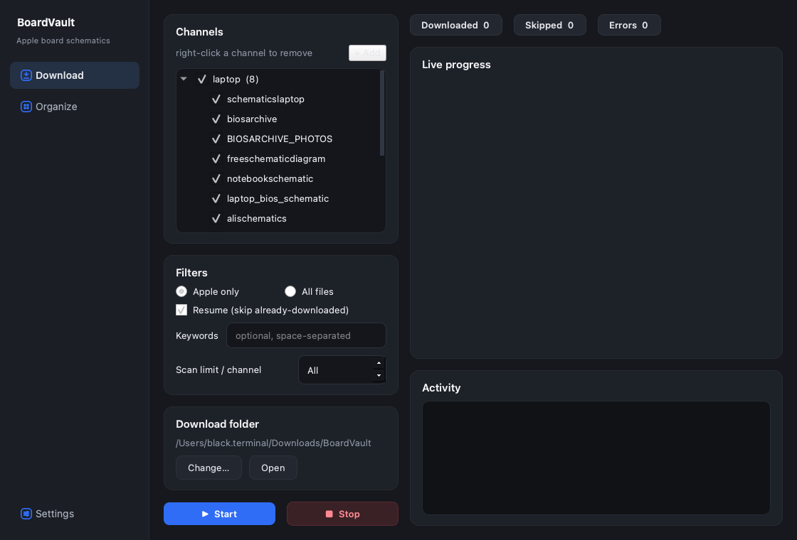
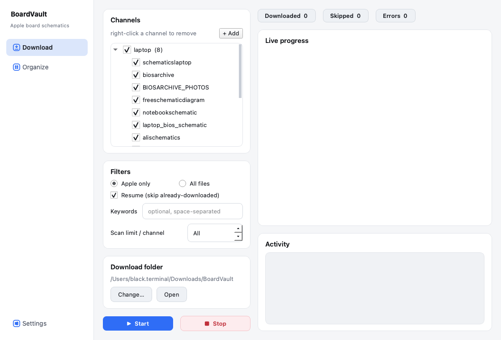

# BoardVault

**Apple schematic & boardview downloader** — a native macOS app (and CLI) that downloads and
organizes Apple device schematics and boardview files from public Telegram channels. Clean
originals, no watermarks.



<details>
<summary>Light theme</summary>



</details>

## What it is

BoardVault wraps a battle-tested Telegram scraper in two front-ends:

- **Desktop app (macOS):** a clean PySide6 GUI — pick channels, filter, watch live per-channel
  progress, then sort everything into a tidy `Apple/<product>` and `<brand>` library. System/Dark/Light
  themes, guided Telegram login (no terminal), and a configurable download folder.
- **CLI:** the original single-file scraper for power users, automation, and headless/cloud runs.

Both share the same engine, state file, and Telegram session, so you can switch freely.

---

## Install (macOS app)

1. Download or build `BoardVault.dmg` (see **Build from source** below), open it, and drag
   **BoardVault** into **Applications**.
2. The app is **unsigned**, so on first launch macOS Gatekeeper will block it. Open it once via
   either:
   - **Right-click** BoardVault in Applications → **Open** → **Open**, or
   - Terminal: `xattr -dr com.apple.quarantine "/Applications/BoardVault.app"`
3. After the first open it launches normally.

> BoardVault stores its data in `~/Library/Application Support/subkoks/BoardVault/` and downloads to
> `~/Downloads/BoardVault/` by default (changeable in-app).

## Using the app

1. **Get Telegram API credentials** (free, ~2 min) at **<https://my.telegram.org>** → *API
   development tools* → note your **API ID** and **API Hash**.
2. **Settings → Account:** paste the API ID and hash (stored locally in `.env`, never uploaded).
3. **Download tab:** choose channels (add/remove your own with **+ Add** / right-click), pick a
   filter (**Apple only** or **All files**), then **Start**. The first run asks for your phone
   number, login code, and 2FA password — all in-app.
4. Watch **Live progress** per channel; files land in your **Download folder** (**Change…** / **Open**).
5. **Organize tab:** **Scan (dry-run)** to preview the classification, then **Organize** to sort
   files into `Apple/Computers/MacBook_Pro`, `Apple/Phones/iPhone`, etc. Every move is reversible
   with **Undo**.
6. **Settings → About & Help** has the quick-start, links, and version info.

---

## CLI

For automation or headless runs, use the scraper directly.

### 1. Credentials & install

```bash
cp .env.example .env          # then edit: TG_API_ID=... and TG_API_HASH=...
pip install -e .              # core CLI deps only
```

### 2. Run

```bash
# All Apple products (recommended); always add --resume on re-runs
python src/tg_schematic_downloader.py --apple --resume

# Test run — only scan the last 2000 messages per channel
python src/tg_schematic_downloader.py --apple --limit 2000

# Only specific keywords / channels
python src/tg_schematic_downloader.py --filter "820-02" iphone
python src/tg_schematic_downloader.py --channels SMART_PHONE_SCHEMATICS schematicslaptop --apple

# List channels, keywords, and extensions
python src/tg_schematic_downloader.py --list-channels

# Organize downloads into the categorized library
python src/organize_downloads.py --dry-run   # preview
python src/organize_downloads.py             # execute
python src/organize_downloads.py --undo      # reverse
```

State is saved to `data/state.json` after every file, so `--resume` safely skips what you already
have.

---

## Channels & filters

**Default channels** (editable in-app): laptop/desktop (`@schematicslaptop`, `@biosarchive`,
`@BIOSARCHIVE_PHOTOS`, `@freeschematicdiagram`, `@notebookschematic`, `@laptop_bios_schematic`,
`@alischematics`, `@hrtechno`), mobile (`@SMART_PHONE_SCHEMATICS`, `@mobileshematic`,
`@schematicmobile`), and Apple-specific (`@Mac_Shematic_Santale`).

**File types:** `.pdf` `.zip` `.rar` `.7z` `.brd` `.bvr` `.bdv` `.bv` `.cad` `.fz` `.asc` `.tvw`
`.pcb` `.ddb` `.cst` `.f2b` `.gr` `.bin` `.rom`.

**Apple filter** matches filenames and captions against product names, board-number prefixes
(`820-`, `051-`), and iPhone/iPad/Mac codenames (e.g. `n61`, `j137`, `A2141`, `EMC 2835`).

## Build from source

```bash
pip install -e ".[gui]"            # GUI deps (PySide6, qasync)
./scripts/run_gui.sh               # run the app in development

pip install -e ".[build]"          # packaging deps (pyinstaller, dmgbuild)
./scripts/build_dmg.sh             # -> dist/BoardVault.dmg
```

The app icon is generated with `./scripts/make_icon.sh` (built-in `sips`/`iconutil`).

## Troubleshooting

- **"BoardVault is damaged / from an unidentified developer":** it's unsigned — use the right-click →
  Open or `xattr` step in **Install** above.
- **Login loops / wrong code:** re-open **Settings → Account → Log out**, then Start again.
- **A channel won't resolve:** make sure the `@name` is exact and the channel is public/you've joined it.

## Documentation

- [docs/USER_GUIDE.md](docs/USER_GUIDE.md) — step-by-step usage
- [docs/architecture.md](docs/architecture.md) — how the app and CLI fit together
- [docs/decisions/](docs/decisions/) — architecture decision records

## Codex CLI

Codex CLI can use this repo's `AGENTS.md` and `.codex/config.toml` for the same workspace guidance.

Recommended entrypoint:

```bash
cd ~/Projects/Current/Active/apple-all-schematic
codex
> Read AGENTS.md and CLAUDE.md before making changes.
```

## Requirements

- macOS (for the app) · Python 3.10+ (for the CLI / building) · a Telegram account · free API
  credentials from <https://my.telegram.org>

## Legal & responsible use

Schematics and boardviews are downloaded from **public** Telegram channels and are intended for
**device repair and education**. Respect intellectual-property rights and your local laws. BoardVault
does not host, rehost, or distribute any files itself.

## License

MIT — see [LICENSE](LICENSE). Built with [Telethon](https://github.com/LonamiWebs/Telethon),
[PySide6](https://doc.qt.io/qtforpython/), and [qasync](https://github.com/CabbageDevelopment/qasync).
