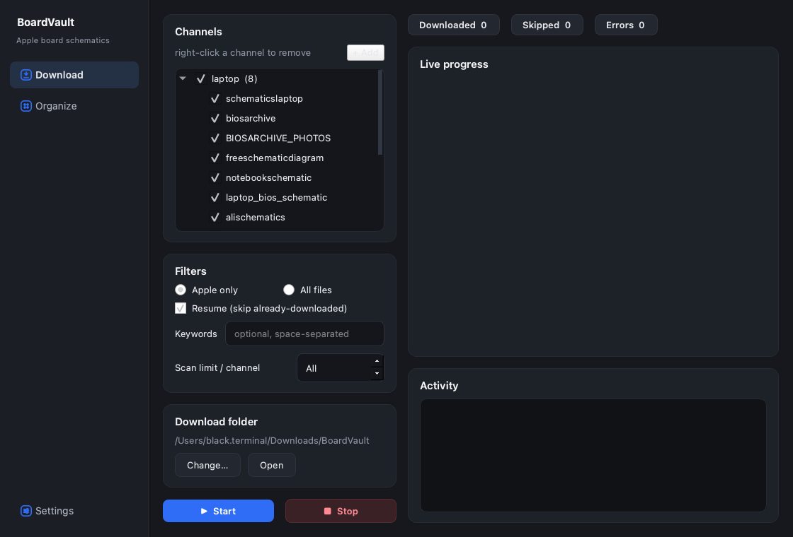
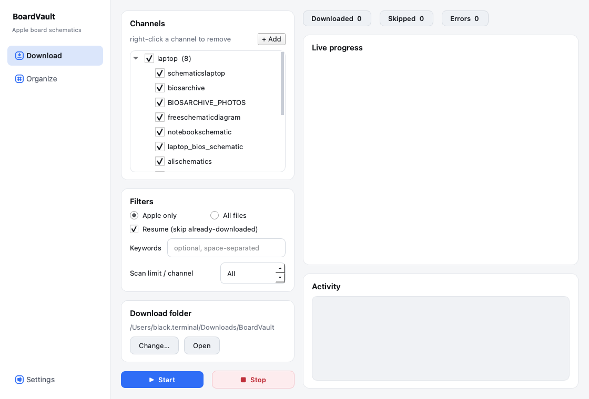

# BoardVault

**Apple schematic & boardview downloader** — macOS desktop apps and a CLI that downloads and
organizes Apple device schematics and boardview files from public Telegram channels. Clean
originals, no watermarks.



The screenshots above and below show the retained Qt interface. The native interface and its
release candidate are described in the [native guide](docs/NATIVE_USER_GUIDE.md).

<details>
<summary>Light theme</summary>



</details>

## What it is

BoardVault exposes the Python Telegram engine through three front-ends:

- **Existing desktop app (macOS):** a PySide6 GUI — pick channels, filter, watch live per-channel
  progress, then sort everything into a tidy `Apple/<product>` and `<brand>` library. System/Dark/Light
  themes, guided Telegram login (no terminal), and a configurable download folder.
- **Native app candidate (2.1.0-rc.1, macOS 13+, Intel):** SwiftUI + AppKit, with a separate Python sidecar.
  Download, Organize, Library, Keychain settings, keyboard commands, Dock progress, and notifications.
- **CLI:** the original single-file scraper for power users, automation, and headless/cloud runs.

The installed desktop apps share the Application Support state/session location. The CLI and Qt
development mode retain repo `data/`; native development uses Application Support. Close other
BoardVault clients before accessing shared state. No sessions are copied automatically.

---

## Install (macOS apps)

**Native candidate:** use the versioned native ZIP or DMG from a verified candidate release.
Unzip or mount it and drag BoardVault.app into Applications. The local preparation command is
`./scripts/build_native_app.sh`; release assets and hashes are written to
`dist/releases/2.1.0-rc.1-x86_64/`. See the [native guide](docs/NATIVE_USER_GUIDE.md) and
[candidate release notes](docs/releases/2.1.0-rc.1.md). Publication is tracked separately from
local preparation; a candidate is not a claim of final platform acceptance.

**Qt app (2.0.0):**

1. Download or build `BoardVault.dmg` (see **Build from source** below), open it, and drag
   **BoardVault** into **Applications**.
2. The app is **unsigned**. If macOS blocks a trusted download, use System Settings → Privacy &
   Security → **Open Anyway** after attempting to open it, following
   [Apple's instructions](https://support.apple.com/en-us/102445).
3. After the first open it launches normally.

> BoardVault stores its data in `~/Library/Application Support/subkoks/BoardVault/` and downloads to
> `~/Downloads/BoardVault/` by default (changeable in-app).

## Using the Qt app

1. **Get Telegram API credentials** (free, ~2 min) at **<https://my.telegram.org>** → *API
   development tools* → note your **API ID** and **API Hash**.
2. **Settings → Account:** paste the API ID and hash (stored locally in `.env`, never uploaded).
3. **Download tab:** choose channels (add/remove your own with **+ Add** / right-click), pick a
   filter (**Apple only** or **All files**), then **Start**. The first run asks for your phone
   number, login code, and 2FA password — all in-app.
4. Watch **Live progress** per channel; files land in your **Download folder** (**Change…** / **Open**).
5. **Organize tab:** **Scan (dry-run)** to preview the classification, then **Organize** to sort
   files into `Apple/Computers/MacBook_Pro`, `Apple/Phones/iPhone`, etc. Every move is reversible
   with **Undo**.
6. **Settings → About & Help** has the quick-start, links, and version info.

---

## CLI

For automation or headless runs, use the scraper directly.

### 1. Credentials & install

```bash
cp .env.example .env          # then edit: TG_API_ID=... and TG_API_HASH=...
pip install -e .              # core CLI deps only
```

### 2. Run

```bash
# All Apple products (recommended); always add --resume on re-runs
python src/tg_schematic_downloader.py --apple --resume

# Test run — only scan the last 2000 messages per channel
python src/tg_schematic_downloader.py --apple --limit 2000

# Only specific keywords / channels
python src/tg_schematic_downloader.py --filter "820-02" iphone
python src/tg_schematic_downloader.py --channels SMART_PHONE_SCHEMATICS schematicslaptop --apple

# List channels, keywords, and extensions
python src/tg_schematic_downloader.py --list-channels

# Organize downloads into the categorized library
python src/organize_downloads.py --dry-run   # preview
python src/organize_downloads.py             # execute
python src/organize_downloads.py --undo      # reverse
```

State is saved to `data/state.json` after every file, so `--resume` safely skips what you already
have.

---

## Channels & filters

**Default channels** (editable in-app): laptop/desktop (`@schematicslaptop`, `@biosarchive`,
`@BIOSARCHIVE_PHOTOS`, `@freeschematicdiagram`, `@notebookschematic`, `@laptop_bios_schematic`,
`@alischematics`, `@hrtechno`), mobile (`@SMART_PHONE_SCHEMATICS`, `@mobileshematic`,
`@schematicmobile`), and Apple-specific (`@Mac_Shematic_Santale`).

**File types:** `.pdf` `.zip` `.rar` `.7z` `.brd` `.bvr` `.bdv` `.bv` `.cad` `.fz` `.asc` `.tvw`
`.pcb` `.ddb` `.cst` `.f2b` `.gr` `.bin` `.rom`.

**Apple filter** matches filenames and captions against product names, board-number prefixes
(`820-`, `051-`), and iPhone/iPad/Mac codenames (e.g. `n61`, `j137`, `A2141`, `EMC 2835`).

## Build from source

```bash
pip install -e ".[gui]"            # GUI deps (PySide6, qasync)
./scripts/run_gui.sh               # run the app in development

pip install -e ".[build]"          # packaging deps (pyinstaller, dmgbuild)
./scripts/build_dmg.sh             # -> dist/BoardVault.dmg
```

The app icon is generated with `./scripts/make_icon.sh` (built-in `sips`/`iconutil`).

See [additional channel sources](docs/channel-sources.md) for 10 optional native additions,
coverage examples, and the distinction between current public previews and archived evidence.

## Native SwiftUI app

The existing PySide6 GUI and its packaging scripts remain unchanged. The native source is in
`native/BoardVault/` with no third-party Swift dependencies. It targets macOS 13 and Intel x86_64;
actual execution has been checked on this Intel Tahoe Mac, not on a separate Ventura installation.

```bash
# Development (uses the repo .venv Python sidecar; create it with uv venv if absent)
uv pip install --python .venv/bin/python -e '.[dev]'
swift run --package-path native/BoardVault BoardVault

# Native tests, without loading .env or accessing Telegram
(cd tests && PYTHONPATH=../src PYTHON_DOTENV_DISABLED=1 ../.venv/bin/python -m pytest -q -c ../pyproject.toml --rootdir=. --confcutdir=. .)
swift test --package-path native/BoardVault --arch x86_64

# Build a separate native app and DMG
./scripts/build_native_app.sh
open dist/native/BoardVault.app

# Fixture-only app launch, screenshots, scan / organize / undo
.venv/bin/python scripts/smoke_native_app.py
# Offline packaged-engine check (no desktop access required)
.venv/bin/python scripts/smoke_native_engine.py
```

The build creates `.venv-native-build/` with a managed portable Python runtime and pinned build
requirements. It does not reuse a host Python that requires a newer macOS. All bundled Mach-O
binaries are checked for architecture, minimum OS, and external library dependencies before
packaging. Existing output is retained under `build/native.*/previous-*`.
`ARCH` in `scripts/build_native_app.sh` controls the architecture; `universal2` also requires a
pre-provisioned universal Python environment and universal binary dependencies.

Use `./scripts/build_native_app.sh --app-only` when disk-image services are unavailable. In that
mode, any existing DMG remains an earlier artifact. See the current
[verification report](docs/native-verification.md) before distributing a local build.

Outputs: **`dist/native/BoardVault.app`** and **`dist/BoardVault-native.dmg`**. These are locally
ad-hoc signed, not Developer ID signed or notarized. The native bundle identifier is
`com.subkoks.boardvault.native`. Keep it in a separate folder if retaining both desktop apps.

In the native app:

- **Settings → Account:** save API ID/hash to Keychain, or explicitly select a legacy `.env` using
  **Import legacy .env…**. Launching the app does not read credentials. Log in uses phone/code/2FA
  sheets; Log out invalidates the shared Telegram session after confirmation.
- **Download:** select and reorder channels, Apple/all files, optional search terms, scan limit,
  and resume. The top search field defaults to **Any word** for wider results. **Search options**
  offers All words, Exact phrase, filename/caption scope, and PDF/boardview/archive/firmware
  filters. Whole terms keep `M5` from matching `M50`; joined `MacBookPro` and `M5Pro` are
  recognized. Archives are filtered by their own extension, not their contents. Public subscriber
  counts, when available, are approximate and can be refreshed beside Channels. Library search
  still requires all whole words in filenames. This is text matching, not a verified
  board-to-processor database. Channel progress appears in one row, and the activity log is
  below Settings in the sidebar.
  **⌘R** starts; **⌘.** stops; **⌘,** opens Settings. Speed is aggregate transferred bytes over elapsed
  time; ETA describes the current file because Telegram does not supply a full filtered-run size.
- **Organize:** scan first, review the file/category/destination table, then confirm Organize.
  A changed preview is rejected. Undo reverses the last native batch without discarding newer
  state entries. Native and legacy GUI undo journals are separate.
- **Library:** browse product/brand folders, search filenames, Quick Look, Open, or Reveal in Finder.
- **Settings:** choose download/library folders, System/Dark/Light appearance, reveal-on-completion,
  and opt-in notifications. Native preferences are stored separately from Qt preferences.

State/session: `~/Library/Application Support/subkoks/BoardVault/`; downloads:
`~/Downloads/BoardVault/`; library: the state root's `organized/`. JSON mode accepts explicit
`--data-dir`, `--download-dir`, and `--organized-dir` for deliberate legacy reuse or isolated tests.
Native operations serialize access to shared state; the older CLI/Qt do not honor that lock.
Native downloads require a filesystem supporting hard links (the default APFS location does).

**Acceptance limitation:** automated login/download checks use fake Telegram clients and mock
sidecars. The user confirmed a real channel download with live progress and completion on 2026-10-05.
The agent has not accessed credentials or sessions; fresh-login prompts remain a manual check. Keychain integration, Quick Look interaction, and delivered
notifications require manual desktop checks. An interrupted organizer with conflicting copies
stops for recovery rather than overwriting either copy.

See [ADR 0002](docs/decisions/0002-native-swiftui-frontend.md) for the IPC contract and decisions.

## Troubleshooting

- **"BoardVault is damaged / from an unidentified developer":** it's unsigned — use the right-click →
  Open or `xattr` step in **Install** above.
- **Login loops / wrong code:** re-open **Settings → Account → Log out**, then Start again.
- **A channel won't resolve:** make sure the `@name` is exact and the channel is public/you've joined it.

## Documentation

- [docs/USER_GUIDE.md](docs/USER_GUIDE.md) — step-by-step usage
- [docs/architecture.md](docs/architecture.md) — how the app and CLI fit together
- [docs/decisions/](docs/decisions/) — architecture decision records

## Codex CLI

Codex CLI can use this repo's `AGENTS.md` and `.codex/config.toml` for the same workspace guidance.

Recommended entrypoint:

```bash
cd ~/Projects/Current/Active/apple-all-schematic
codex
> Read AGENTS.md and CLAUDE.md before making changes.
```

## Requirements

- macOS (for the app) · Python 3.10+ (for the CLI / building) · a Telegram account · free API
  credentials from <https://my.telegram.org>

## Legal & responsible use

Schematics and boardviews are downloaded from **public** Telegram channels and are intended for
**device repair and education**. Respect intellectual-property rights and your local laws. BoardVault
does not host, rehost, or distribute any files itself.

## License

MIT — see [LICENSE](LICENSE). Built with [Telethon](https://github.com/LonamiWebs/Telethon),
[PySide6](https://doc.qt.io/qtforpython/), and [qasync](https://github.com/CabbageDevelopment/qasync).
